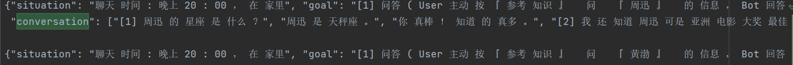

# 基于SeqSeq的情感聊天机器人

## 数据处理

### 数据集搜集

  1. [数据集来源](https://github.com/codemayq/chinese_chatbot_corpus)
     - [x] 聊天机器人
     - [ ] 豆瓣多轮
     - [x] [PTT八卦语料](https://github.com/zake7749/Gossiping-Chinese-Corpus)
     - [x] 青云语料 
     - [ ] 电视剧对白语料
     - [x] 贴吧论坛回帖语料
     - [x] 微博语料
     - [x] 小黄鸡语料  
  2. [百度DuRecDial](https://baidu-nlp.bj.bcebos.com/DuRecDial.zip)
     DuRecDial包含多种类型的对话(推荐对话、闲聊、任务导向对话和QA)，来自7个领域(电影、明星、音乐、新闻、食物、poi和天气)的10.2k对话，以及156K个utterances。
  3. 

### 数据集处理

  1. 统一格式
     - `聊天机器人`: 按行处理,原数据中`- -`为`Question`,`-`为`Answer`。去除标识和多余的空格，忽略数据集开头的对话类别，以`\t`分隔问答。
     - `青云语料`: 按行处理，原数据中一行为一个问答对，以`|`分隔。去除`|`符号，以`\t`分隔问答。
     - `贴吧论坛回帖语料`:按行处理，原数据中一行为一个问答对，以`  `分隔。去除`  `符号并以`\t`分隔问答。
     - `微博语料`原数据问答对存放在两个文件中，需要同时对两个文件进行处理，去除问答中间的空格，并合并成一个文件，以`\t`分隔问答。
     - `小黄鸡语料`:按行处理，原数据中`M`为对话行，`E`为分割行。去除标识和多余的空格，以`\t`分隔问答。
     - `百度DuRecDial`:多轮对话，每行以`solution`开头，以`conversation`为对话起始，可在每行中找出对话起始位置再进行清理。
        
        先定位对话位置，截取对话，删除对话中多余的空格和`[数字]`，以`","`分隔字符串，在写入文件时，再山区两边的`”`，并以`\t`分隔问答。
  2. - 

